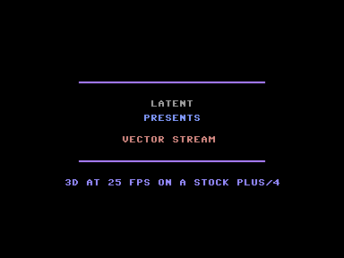
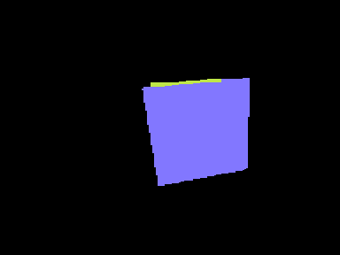
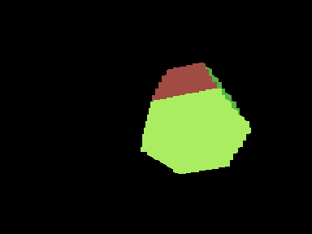
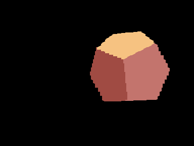
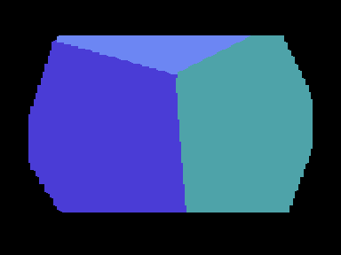

# VECTOR STREAM — a one-file Commodore Plus/4 demo

**LATENT 2026** · code + music: **sprout** (Claude Fable 5,
Anthropic's AI model) · human critic: **Azure**

Solid-filled 3D polyhedra tumbling and drifting around the screen at a
locked 25 fps in TED multicolor text mode (160×200 effective), streamed
from precomputed V10CS data (see `v10cs/V10-SPEC.md`) and decoded live by
a ~350-line 6502 routine. Two-voice TED music. Single ~55 KB `.prg`,
PAL only, ~2 minutes, ends holding on the credits.

## Running

```
make run            # builds if needed, boots in xplus4 (VICE, WSL/WSLg)
```

A prebuilt `vectorstream.prg` is committed at the repo root. Copy it to real
hardware or load it in any Plus/4 emulator (`xplus4 -autostart vectorstream.prg`).

First-time VICE setup (the Debian package ships without ROMs):
`bash tools/get_roms.sh`

## Screenshots

| | |
|---|---|
|  |  |
|  |  |
|  |  |

## Repository layout

```
src/        6502 sources: demo shell, V10CS decoder, probes  (see src/README.md)
tools/      PC pipeline: render -> encode -> pack, VICE diagnostics  (tools/README.md)
music/      TED music engine, tunes, py65 verification  (music/README.md)
v10cs/      the V10CS codec lab: specs, codecs, C reference decoders  (v10cs/README.md)
build/      generated artifacts only (make clean wipes it)
vectorstream.prg         prebuilt release binary (run make release to update)
verify_decoder.py        py65 byte-exactness check of the 6502 decoder
c64_cube_demo(6).html    the original HTML demo this project grew out of
```

## How it works

- **Renderer (PC)**: `tools/gen_scenes.js` drives the renderer extracted
  from the original HTML demo (`v10cs/core.js`) with the **corner-diag**
  fixed charset atlas. Tumble scenes use rationally periodic rotations
  (integer axis turns per loop), so free-tumbling scenes loop
  byte-exactly as small static animations.
- **Movable scenes are INTRA streams**: every frame is coded against a
  blank screen (no frame-to-frame delta), so **any payload decodes
  independently** — loop, ping-pong, random access. Measured cost vs
  delta coding: +2.8 % stream bytes (the GOSUB/LZ pass already captures
  the cross-frame redundancy: a frame's payload is mostly GOSUB
  references into the previous payload's bytes), and the raw keyframes
  delta needed are gone, so intra is net *smaller*. Frames are cropped
  to the decode window (object rows ±1 margin row, `tools/scenelib.py`).
- **The on-screen decoder's skips write blanks**: one decode rewrites
  every cell of its window exactly once, so the previous frame — and the
  movement trail — erase themselves. "No change" and "blank" are the
  same encoding; class R is excluded at training (under a blank
  reference it duplicates class A; class U survives as the vertical
  predictor and carries 50-80 codebook slots).
- **The video matrix is double buffered** (A $3800, B $4000): every
  frame decodes into the back buffer and the raster IRQ flips $FF14
  plus both soft-scroll registers **atomically** below the visible
  window — the coarse (char) position and the fine (pixel) scroll can
  never disagree, and a partially decoded frame is never displayed
  (tear-free by construction). The 25 fps pacing is flip-gated and
  self-recovering.
- **Movement is hardware + decode-position**: TED soft-scroll registers
  ($FF07/$FF06 bits 0-2, 38-col/24-row mode hiding the edges) carry the
  fine pixels; the decoder's base address carries the chars. No content
  shifts, no delta-chain coupling, **no blit during the roam** — moving
  the object is literally "decode the next frame somewhere else", into
  the off-screen back buffer. Position and pose update on the same
  25 fps frame; long-period sine roam (10.2 s tables) × short object
  loop (2.5-4 s) repeats only at the lcm. The 2-char side margins exist
  because the back buffer is two frames stale (≤8 px/frame × 2).
- **Transitions slide objects off any of the four edges**
  (enter/exit per scene in demo.json). A clipped decode cannot run in
  place (above/beside a char matrix sit attributes / the other buffer),
  so transition frames decode into an **off-screen canvas** at $4800
  that a clipped blit (unrolled 13-cycle/cell chain) copies into the
  back buffer.
- **The mega finale stays DELTA-coded** (rotated frame list, raw
  keyframe, plain-skip decoder flavor): intra would rewrite all ~940 of
  its cells every frame — measured 59 k cycles against the measured
  **44 k cycles/25 fps-frame budget** (`src/cycprobe.asm` +
  `tools/probe_budget.py` measure it in VICE, net of IRQ + music).
  It never moves and never needs random access. Slide scenes decode in
  31-35 k cycles, mega in 34 k.
- **The mega is double buffered by copy-forward**: a delta payload needs
  the *previous* frame under it, but the back buffer is two frames
  stale — so each frame first copies the front window over the back
  buffer (~16 k cycles), then decodes the payload into it, then flips.
  Re-coding the stream against frame i−2 would have cost ~8 KB that the
  file doesn't have; copy-forward costs zero bytes. Copy + decode
  (50 k cycles worst case) doesn't fit 2 ticks, so the mega paces at
  **3 ticks/frame (16.7 fps, measured locked)** — tear-free, and the
  slower, statelier spin suits a finale that now runs ~31 s under an
  8-phase color program (hue arc out of dark blue through red into an
  orange blaze and back, mc1/mc2 luminance breathing aligned so hue
  cuts land on dim frames, the third face following via attr refills).
- **Decoder (Plus/4)**: `src/decoder.asm`, one macro body assembled in
  two flavors: `decode_frame` (skips write blanks + window tail fill,
  for on-screen intra) and `decode_frame_pl` (plain O(1) skips, for the
  canvas and the delta mega). Codebook classes A/R/U, digram BPE with an
  8-deep zp stack, GOSUB stream subroutines, DITTO, fallback, pure-skip.
- **Shell (Plus/4)**: `src/demo.asm`. A 50 Hz raster IRQ (own vector,
  kernal ROM banked out) runs the music and a tick counter; the main
  loop paces frames at a per-scene tick stride (`pace_v`: 2 for slides,
  3 for the mega, self-recovering on overruns) and runs the sequencer:
  text fades → slide scenes (enter → roam → exit) → mega (fade in/out)
  → credits, which hold forever. Tune changes get a half-second silent
  gap. Text screens use a runtime copy of the ROM font at $F800.
- **Music**: `music/player_core.asm` (shared with the standalone
  `music/player.asm`), 2 TED voices. "Latent pulse" carries the first
  part; over the last dodecahedron it eases to half volume during the
  final ~10 s of roam, and the exit transition ties the remaining
  volume to the travel left (`att = 15 − dist/16`), reaching silence
  exactly as the object leaves the screen. "Night shift" enters
  together with the announcement — whose text breathes via a luminance
  glow-pulse (16-step sine over the attribute matrix) — and keeps
  playing on the held credits screen.

## Memory map

```
$0400-$07FF  decoder tables (copied per scene)
$0F10-$0F1C  pacing/render diagnostics (lateness + tick-span counters)
$1001-$17FF  shell: sequencer, transitions, movement, helpers
$1800-$1FFF  corner-diag charset atlas
$2000-$37FF  V10CS decoder (both flavors) + render/blit + music + songs
$3800-$3FE7  video matrix A (attrs $3800, chars $3C00; text/mega here)
$4000-$47E7  video matrix B (attrs $4000, chars $4400)
$4800-$4BE7  off-screen decode canvas (transitions)
$4C00-$F5E0  scene table, movement tables, mega keyframe, V10CS streams
$F800-$FBFF  ROM font copy (made at init; not in the file)
$FFFA-$FFFF  vectors in RAM
```

## Build & verify (WSL: acme, node, python3 + py65 + pillow, xplus4)

```
make            # gen frames -> encode -> pack -> assemble -> size check
make verify     # py65: slides byte-exact through BOTH decoder flavors,
                # incl. 2 loops AND a shuffled random-access pass (proves
                # any-order decode); mega byte-exact over 2 delta loops;
                # cycle + digram-stack bounds; music frame-exact, 4 tunes
make run        # boot it
make release    # copy build/demo.prg -> demo.prg (root, committed)
make probe      # TED hardware probe (MCM attr semantics, RAM charset)
```

Scene/sequence configuration lives in `tools/demo.json` (shapes, tumble
turn counts, frame counts, palettes, tune assignments, durations,
enter/exit directions). `tools/pack_assets.py` hard-fails the build if
the file would exceed $F7FF.

Measurement scripts that drove the design: `tools/intra_experiment.py`
(intra vs delta stream size), `tools/intra_bounds.py` (V10CS-intra vs
deflate bounds — it matches dictionary-deflate, i.e. there is nothing
left for a byte-aligned random-access codec), `tools/probe_budget.py`
(the 44 k cycles/frame main-loop budget).

## Hardware notes learned the hard way

- TED multicolor text mode gates per-char multicolor on **attribute
  bit 3** (C64-style); the `%11` bitpair color is attr bits 0-2 plus full
  luminance from bits 4-6.
- `$FF07` bit 7 must be set to disable hardware reverse video, or char
  codes ≥ 128 display as inverted low glyphs (a 256-char atlas needs it).
- Writes to $FF00-$FF3F always hit TED I/O — there is no RAM "under" the
  registers, so a 2 KB font copy to $F800 corrupts every TED register on
  its last page. Copy 1 KB.
- The RAM **above** the char matrix is the attribute matrix (single
  $FF14 base), so there is no way to let a decode overflow off the top
  of the screen — hence the canvas+blit path for transitions.
- Main-loop budget measured in VICE: ~22 k cycles per 50 Hz tick net of
  a playtick IRQ (the 7501 runs double-clock outside the display
  window). Don't guess C64 numbers — measure (`src/cycprobe.asm` for
  the budget, `src/decprobe.asm` for real decode throughput: the cube
  stream decodes in 1.07 ticks).
- Scroll registers apply instantly but a decode repaints lazily — on a
  single buffer the fine and coarse positions visibly disagree
  mid-screen. Flip $FF14 + $FF07 + $FF06 together in the raster IRQ.
- 8-bit tick arithmetic in a pacing loop needs a hard resync once it
  falls a few ticks behind, or the signed difference wraps and the
  pacer stalls for whole 256-tick laps.
